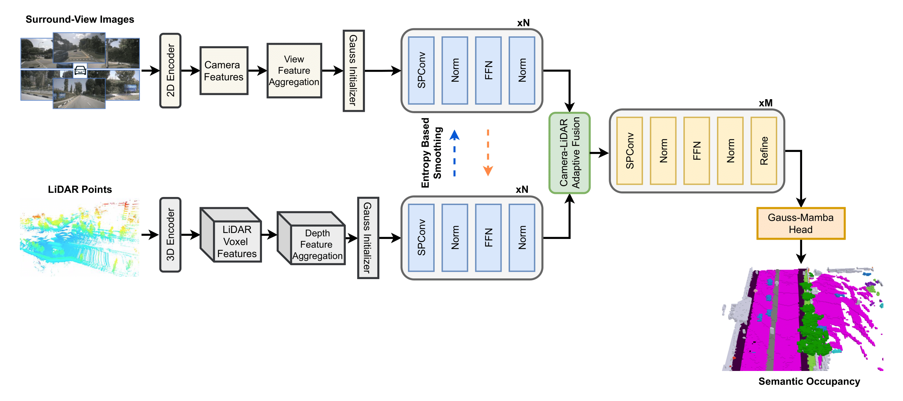

# GaussianOcc3D: A Gaussian-Based Adaptive Multi-modal 3D Occupancy Prediction

### [**A. Enes Doruk**](https://github.com/enesdoruk) and [**Hasan F. Ates**](https://faculty.ozyegin.edu.tr/hfates/)

Official implementation of **GaussianOcc3D**, a novel multi-modal framework that bridges camera semantics and LiDAR geometry through a memory-efficient, continuous 3D Gaussian representation.

---

## Abstract

3D semantic occupancy prediction is a pivotal task in autonomous driving, providing a dense and fine-grained understanding of the surrounding environment. While recent single-modality approaches have shown significant progress, they are inherently limited by the physical trade-offs between the semantic richness of cameras and the precise geometric manifolds of LiDAR. Multi-modal frameworks frequently encounter difficulties in managing modality heterogeneity and spatial misalignment, often resulting in the loss of critical semantic or geometric cues. These challenges are further compounded by a representation crisis: complex voxel-based models suffer from excessive computational demands due to processing empty space, while lightweight Bird's-Eye View (BEV) alternatives often rely on lossy compression that fails to accurately represent vertical structures.

To address these limitations, we present **GaussianOcc3D**, a novel multi-modal framework that bridges camera semantics and LiDAR geometry through a memory-efficient, continuous 3D Gaussian representation where both modalities are projected into a shared Gaussian space. We propose several key innovations: 
* **LiDAR Depth Feature Aggregation (LDFA)** module to resolve geometric sparsity.
* **Entropy-Based Feature Smoothing (EBFS)** to mitigate domain-specific noise.
* **Adaptive Camera-LiDAR Fusion (ACLF)** module featuring uncertainty-aware reweighting.
* **Gauss-Mamba Head** leveraging Selective State Space Models to capture global context with linear complexity. 

Extensive evaluations on the Occ3D, SurroundOcc, and SemanticKITTI benchmarks demonstrate the efficacy of GaussianOcc3D, achieving state-of-the-art mIoU scores of **49.4%**, **28.9%**, and **25.2%** respectively.

---

## 🏗️ Framework Overview

> **Figure 1:** The overall architecture of the proposed GaussianOcc3D framework. The pipeline extracts 2D features via a camera backbone and 3D geometric features via a sparse LiDAR backbone, lifting them into a shared Gaussian space for adaptive fusion and global refinement.

---

 

# 🚀 CODE COMING SOON

## The full implementation and pre-trained models are currently being prepared for public release. 

### Please stay tuned!

 

---
